# Smart Web Portal for Semester Result Management

A web-based application developed using PHP and MySQL to manage and access student semester results efficiently.

## 🚀 Features
- Admin Login and Dashboard
- Faculty Login and Result Entry
- Student Login to View Results
- CGPA Calculation
- Clean and Simple UI

## 🛠 Technologies Used
- PHP
- MySQL
- HTML
- CSS
- JavaScript

## ⚙️ Setup Instructions
1. Clone the repository
2. Import `database.sql` into MySQL
3. Update database connection in `db.php`
4. Run the project using XAMPP (localhost)

## 📸 Screenshots

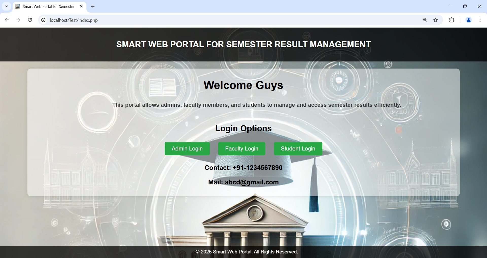
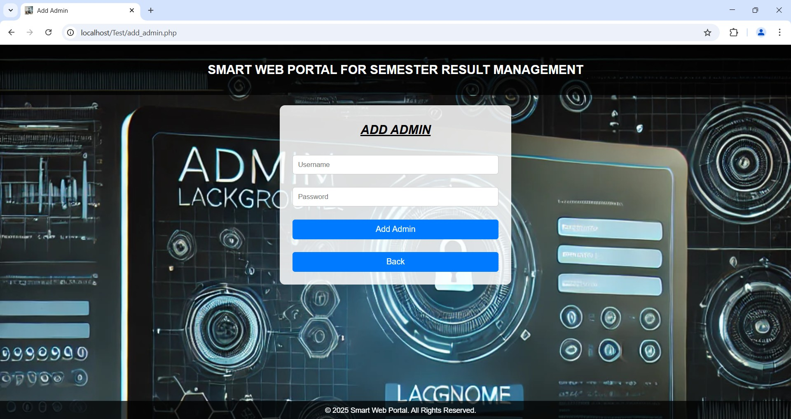
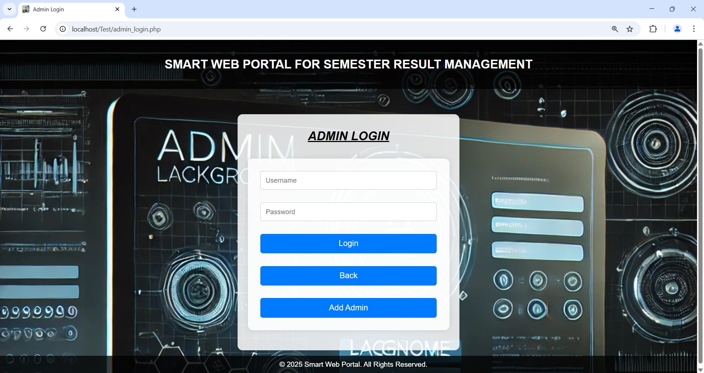
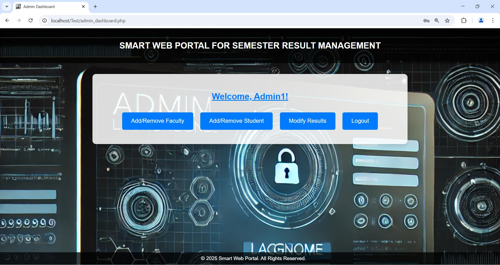
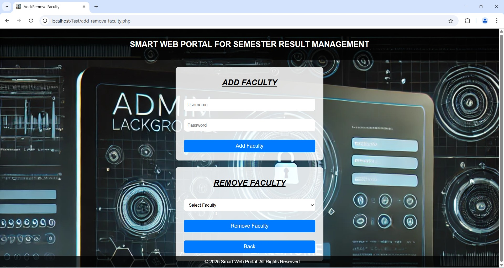
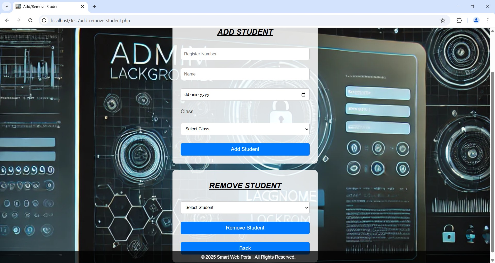
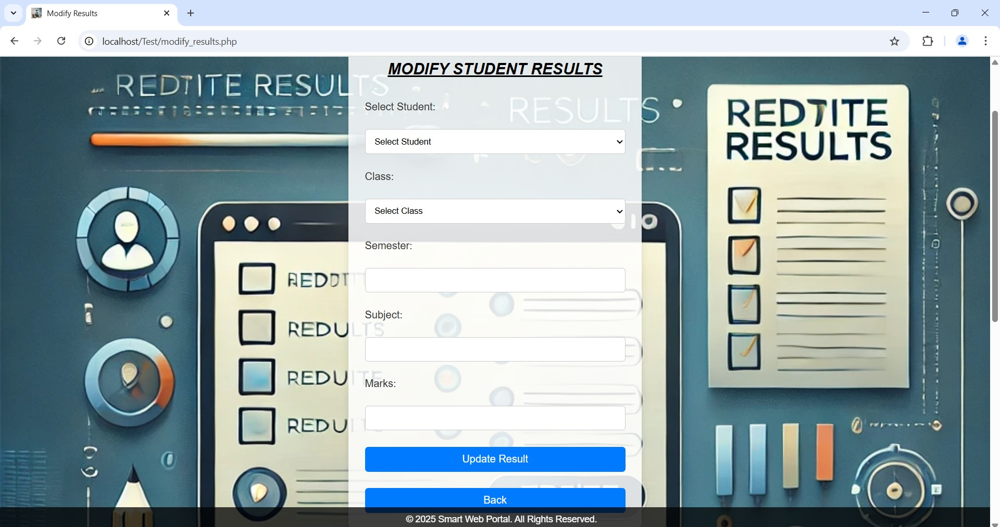
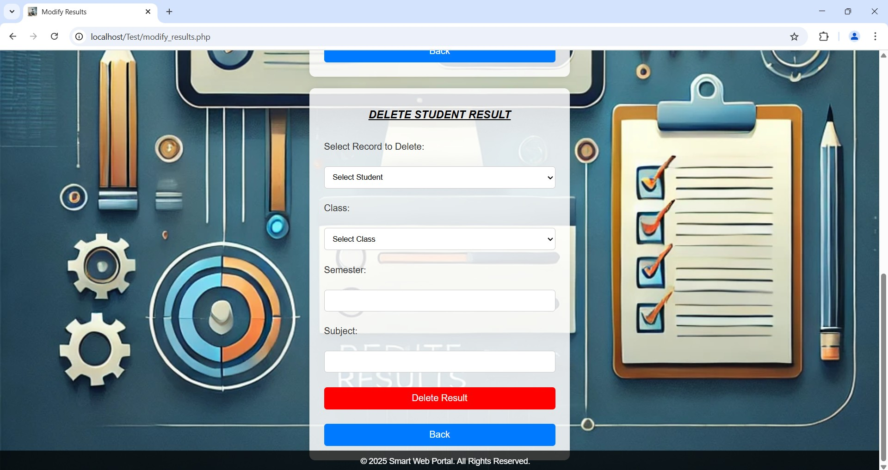
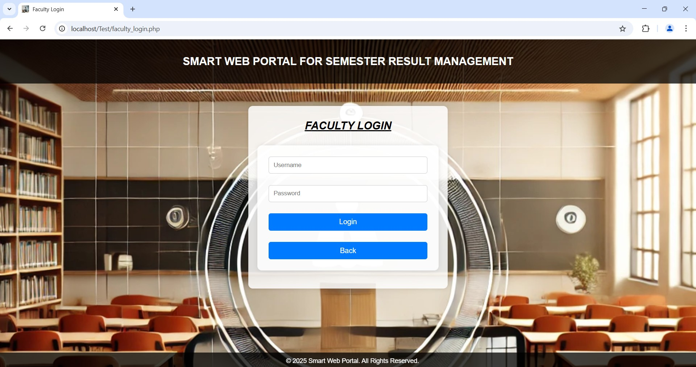
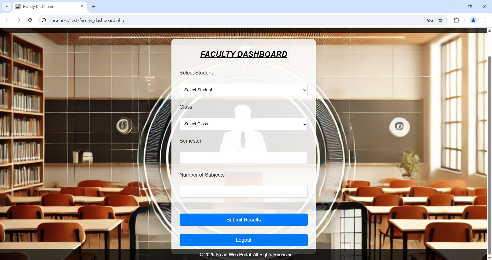
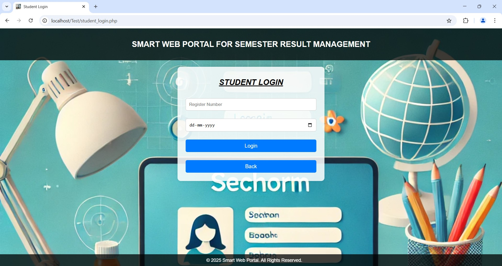
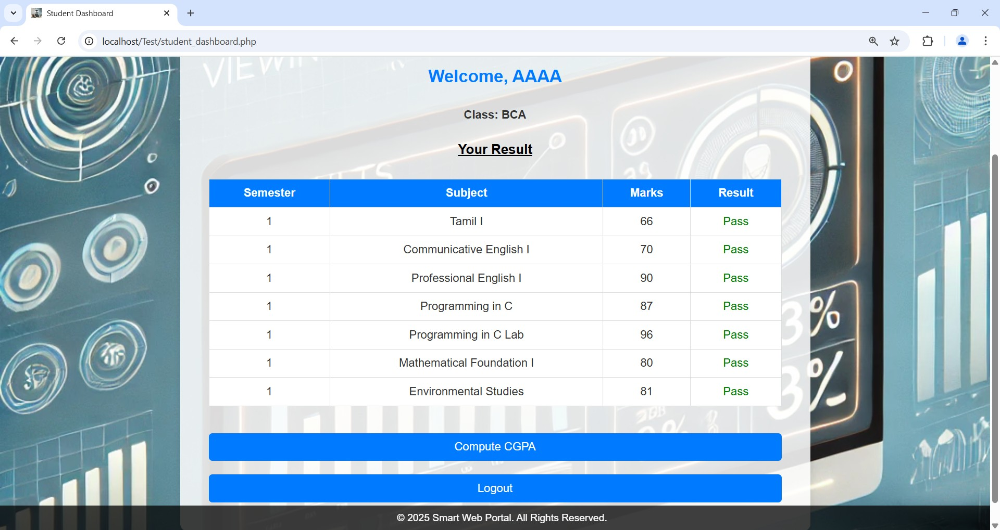
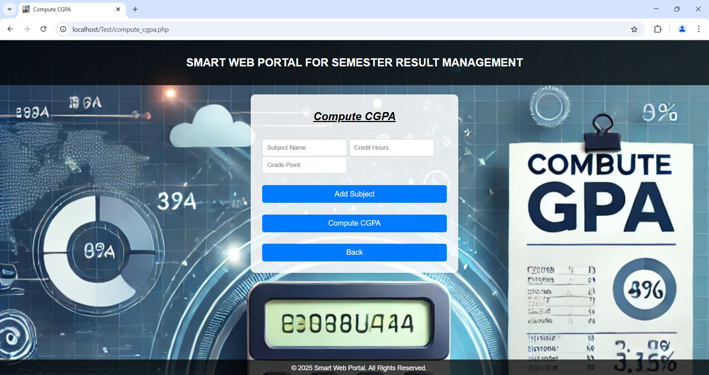

## 📌 Note
This project is developed for educational purposes.

## 👨‍💻 Author
Dinesh D
